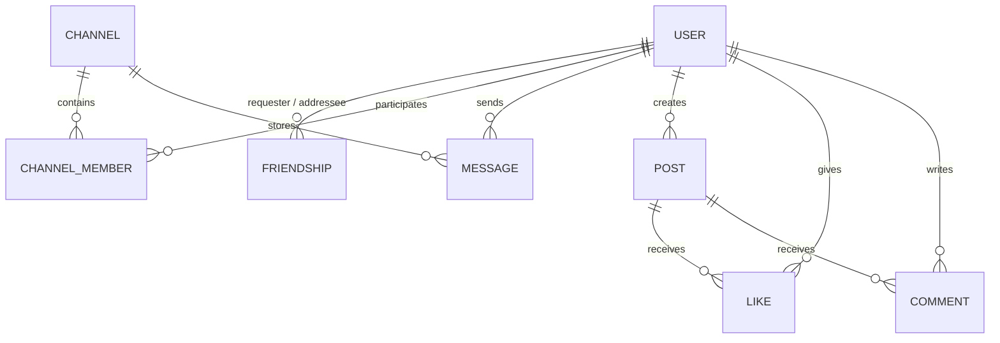

*This project has been created as part of the 42 curriculum by igilbert, jdupuis, norabino, tcarlier.*

# ft_transcendence

An interactive social network and modern web platform featuring real-time chat, advanced user management, and generative AI services. Unlike the standard transcendence project that focuses on a Pong game, this project aims to build a robust Single-Page Application (SPA) providing a seamless social experience, real-time interactions, a social feed, and an intelligent AI assistant.

---

## Features

### Authentication & Security
- Account registration, login, and secure OAuth2 login through the 42 API.
- JWT sessions with optional TOTP Two-Factor Authentication (2FA) protected by a QR code setup flow.
- Routes and conversations protected by JWT, 2FA, and blocking relationships.

### Social Network
- Public profiles with usernames, nicknames, and avatars.
- A dynamic home feed where users can create posts (with images), leave comments, and like content.
- Friend requests (pending, accepted, blocked) and visibility filtering.

### Real-Time Messaging
- Low-latency Socket.IO messaging with JWT authentication during the socket connection.
- Public, private, protected, and direct one-to-one channels.
- Real-time typing indicators, unread badges, and live online/offline presence tracking.

### Hybrid AI Assistant
- **Ollama / Llama 3**, running locally to classify requests and trigger social or navigation actions.
- **Google Gemini**, optional for general conversations, with SSE responses streamed progressively to the frontend.

---

## Installation & Configuration

### Prerequisites
- **Docker** and **Docker Compose**.
- 42 API application credentials if OAuth2 login is required.
- A root `.env` file (refer to `backend/.env.exemple`).
- `make` utility.

### Launch
1. Clone the repository and navigate to the project root.
2. Configure your `.env` file.
3. Build and run using the provided Makefile:
```bash
make up
```
4. Access the application at **https://localhost**.

---

## Team Information & Contributions

- **igilbert (Ivan)** - *Project Manager (PM) / Scrum Master & Developer*
  - **Responsibilities**: Facilitated team coordination, tracked progress, and managed the frontend architecture. Removed UI blockers, designed the global themes, integrated notifications, and managed the project's legal/privacy policies.
  - **Contributions**: Transformed the frontend into a highly polished, responsive product. Designed and implemented the dynamic theming system, wrote the comprehensive privacy policies/CGU, and integrated complex frontend interactions like typing indicators, auto-scrolling, and SVG icon sets. Overcame cross-browser styling issues and successfully integrated PWA service worker notifications.

- **jdupuis (Julien)** - *Product Owner (PO) & Developer*
  - **Responsibilities**: Defined the product vision and prioritized features to meet user needs. Managed the core backend logic, OAuth2, and AI integrations. Validated completed backend features and ensured the social system functioned cohesively.
  - **Contributions**: Integrated the 42 OAuth flow, implemented the complete TOTP 2FA lifecycle, and built the robust Socket.IO chat backend handling multiple channel types. Integrated the generative AI services and designed the relational structure for the social feed. Overcame significant challenges related to real-time state synchronization and AI streaming delays.

- **norabino (Noé)** - *Technical Lead / Architect & Developer*
  - **Responsibilities**: Oversaw technical decisions and architecture. Bootstrapped the backend server, configured the Docker infrastructure, established real-time connection foundations, and ensured robust cybersecurity practices.
  - **Contributions**: Laid the essential groundwork for the project. Configured the entire Docker environment, set up the initial NestJS architecture, and established the foundational database schemas with Prisma. Handled the server configuration and cybersecurity aspects (VPS, reverse proxy) to prepare the application for a stable, public deployment. Overcame challenges related to containerizing the hybrid AI infrastructure.

- **tcarlier (Tristan)** - *Developer*
  - **Responsibilities**: Focused heavily on frontend implementation and user experience. Designed the main dashboard, user search endpoints, interactive side panels, and handled complex frontend state for Two-Factor Authentication.
  - **Contributions**: Focused on core user experience and navigation components. Built the main responsive dashboard layout, the interactive side panels, and the comprehensive user search functionalities. Ensured the 2FA state was correctly persisted and handled cleanly in the frontend UI. Overcame state hydration challenges when syncing the frontend router with the user's authentication status.

---

## Project Management
- **Task Distribution**: Tasks were distributed based on domain expertise: Infrastructure (norabino), Backend & AI (jdupuis), Frontend UI & Notifications (igilbert), and Dashboard/Components (tcarlier).
- **Tools**: GitHub (version control, PRs), Notion/Trello (Kanban task tracking).
- **Communication**: Discord for daily stand-ups and pair programming sessions.

---

## Chosen Modules & Points Breakdown (Total: 16 pts)

### Major Modules (5 x 2 = 10 pts)
* **Web Framework Frontend & Backend (2 pts)**
  * Combined usage of a modern Frontend framework (**React + Vite**) and a structured Backend framework (**NestJS**).
* **Real-Time Features via WebSockets (2 pts)**
  * Low-latency bidirectional communication (online/offline status, instant messaging) using WebSockets (Socket.IO / NestJS Gateways).
* **User Interactions (2 pts)**
  * Instant messaging system, public profile views, and friendship management.
* **User Management & Authentication (2 pts)**
  * Full profile management, custom avatar upload and update, and real-time presence tracking.
* **Complete LLM System Interface (2 pts)**
  * Generative AI integration featuring streaming text responses, fine-grained error handling, and rate limiting.

### Minor Modules (3 x 1 = 3 pts)
* **ORM Usage (1 pt)**
  * **Prisma ORM** for schema modeling, database migrations, and type-safe queries.
* **Remote OAuth 2.0 Authentication (1 pt)**
  * Secure third-party authentication via the **42 API**.
* **Two-Factor Authentication / 2FA (1 pt)**
  * Account protection via TOTP (Time-based One-Time Password) authenticator apps.

### Modules of Choice (3 pts)
* **[MAJOR] Infrastructure & Cloud VPS Hosting with Custom Domain (2 pts)**
  * **Justification:** The project is deployed and publicly accessible on a remote Virtual Private Server (VPS) configured with a custom domain name, HTTPS reverse proxy (Certbot / SSL), and automated CI/CD pipeline.
* **[MINOR] Hybrid AI Architecture (Local Ollama + Cloud Gemini) (1 pt)**
  * **Justification:** Hybrid AI routing implementation combining a local model (Ollama) for fast/private execution and the Cloud Gemini API for complex tasks.

---

## Technical Choices Justification

### Frontend: React + Vite
* **Why React?** Component-driven architecture simplifies UI reusability (modals, chat cards, post feeds) and enables reactive DOM state updates when handling WebSocket events.
* **Why Vite?** Instant development server startup (ultra-fast HMR) and optimized Rollup production builds, delivering superior performance compared to legacy tools.

### Backend: NestJS
* **Why NestJS?** Enterprise-grade TypeScript framework offering a strict modular architecture (*Controllers, Services, Gateways, Modules*) built on dependency injection. Native integration for WebSockets (`@WebSocketGateway`), JWT authentication guards, and Prisma ORM.

### Database & ORM: PostgreSQL + Prisma
* **Why PostgreSQL over MongoDB?**
  1. **Relational Data Integrity:** Relational schema with strict relationships (`User` $\leftrightarrow$ `Friendship`, `Channel` $\leftrightarrow$ `Message`, `Post` $\leftrightarrow$ `Like`). Guarantees native referential integrity using foreign keys and cascading deletions.
  2. **ACID Compliance & Security:** Authentication credentials, 2FA secrets, OAuth tokens, and username/email uniqueness require strict atomic guarantees.
* **Why Prisma?**
  * Auto-generated, 100% type-safe TypeScript client eliminating runtime SQL errors.
  * Declarative, readable schema definitions and migrations managed through `schema.prisma`.

---

## Database Schema (Prisma)

The application relies on the following data model:



---

## Resources
- [NestJS Official Documentation](https://docs.nestjs.com/)
- [React & Vite Documentation](https://react.dev/)
- [Prisma ORM Guide](https://www.prisma.io/docs/)
- [Socket.IO Documentation](https://socket.io/docs/v4/)
- **AI Usage:** AI tools (GitHub Copilot, ChatGPT) were used to debug WebSocket synchronization, layout generation (Tailwind), and prompt engineering for the internal Chatbot.
